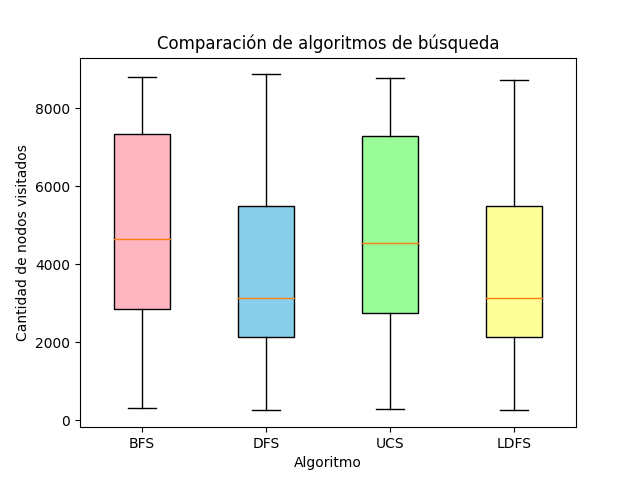

## TP3 - Busquedas no informadas - Francisco Devaux

### Ejercicio B

#### Resultados obtenidos

A continuación se puede observar el gráfico de cajas y extensiones sobre el resultado de ejecutar los algoritmos 30 veces.

Como conclusión al gráfico podemos ver que con los algoritmos de búsqueda en profundidad, podemos recorrer la matriz (en promedio) en un menor numero de pasos.

### Ejercicio C

En el caso de que queremos obtener un resultado en un menor numero de pasos, lo más adecuado es utilizar un algoritmo de búsqueda en profundidad. Sin embargo, si se desea optimizar el camino y obtener el camino más corto lo más adecuado sería utilizar búsqueda en profundidad.
