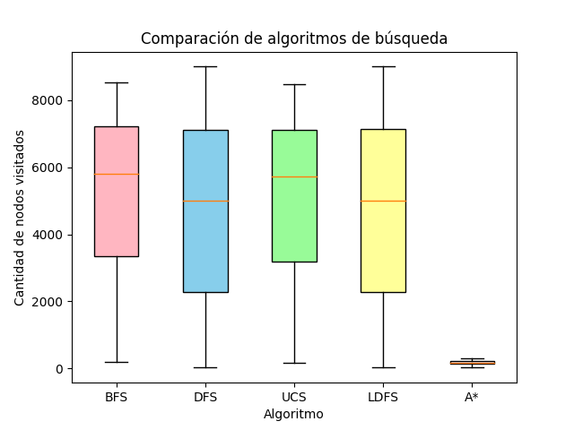

## TP4 - Busquedas informadas - Francisco Devaux

### Ejercicio A

Se aplicó un algoritmo A* con la siguiente heurística h(n) = 2 * euclidean_distance((x,y), goal), donde euclidean_distance retorna la distancia euclideana entre dos puntos, (x,y) es un punto genérico y goal es la posición a donde se desea llegar.

### Ejercicio B

#### Resultados obtenidos

A continuación se puede observar el gráfico de cajas y extensiones sobre el resultado de ejecutar los algoritmos 30 veces.

Como conclusión al gráfico podemos ver que al aplicar el algoritmo de A\* se reduce inmensamente el numero de nodos visitados, haciendo este método el más recomendable. Además siempre se garantiza el camino más óptimo.
