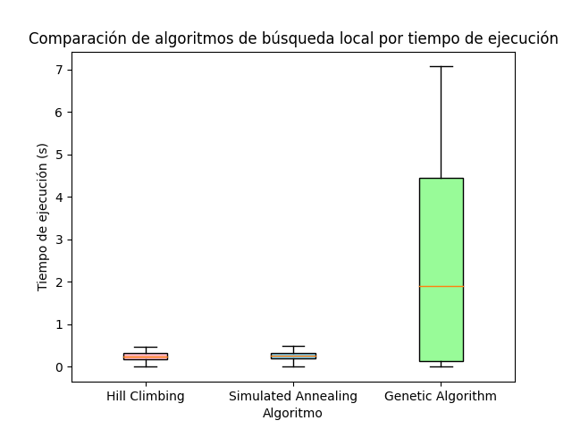
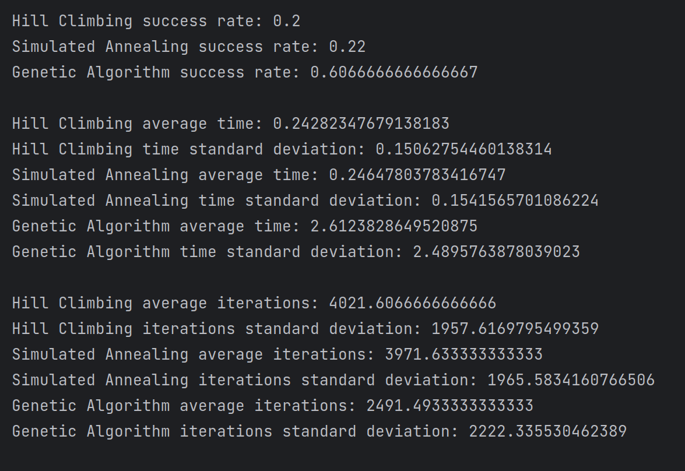
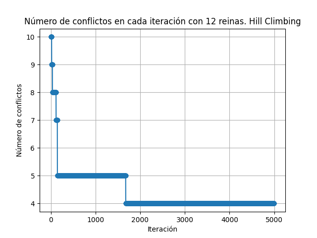
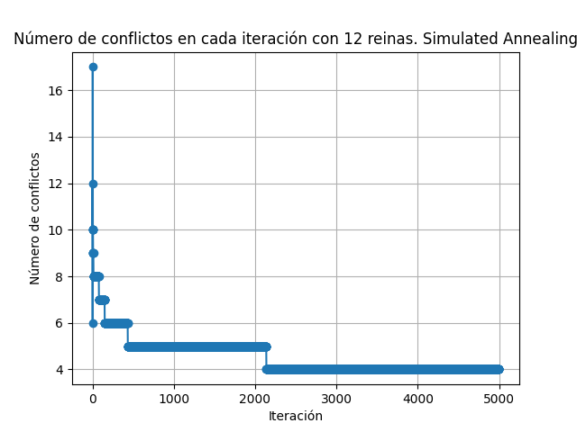
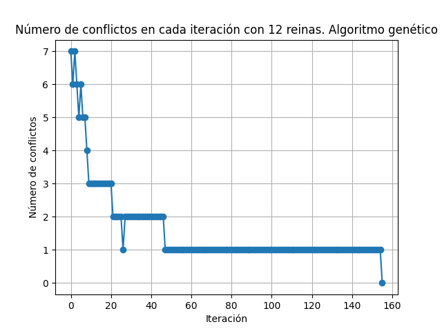

## TP5 - Busqueda Local - Francisco Devaux

### Parte II

#### Resultados obtenidos

A continuación se puede observar el gráfico de cajas y extensiones sobre el resultado de ejecutar los algoritmos 30 veces por cada tamaño de tablero.

Como conclusión al gráfico podemos ver que al ejecutar el algoritmo genético se tarda en promedio mucho más tiempo que con los otros dos algoritmos. Sin embargo, esto no nos dice nada sobre la calidad de la solución obtenida. Para eso, se puede observar los siguientes datos:

#### Crecimiento de funcion h() a lo largo de las iteraciones

#### Opinión sobre algoritmo más adecuado

Tras observar los resultados podemos observar que los algoritmos genéticos tienden a obtener mejores resultados comparados con los otros dos algoritmos. Sin embargo, el tiempo de ejecución es mucho mayor. Por lo tanto, si se desea obtener una solución óptima, se recomienda utilizar el algoritmo genético.
