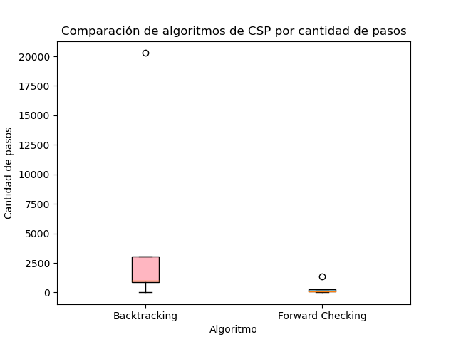

## TP6 - CSP - Francisco Devaux

### 1. Describir en detalle una formulación CSP para el Sudoku.

- Variables: {c00, c01, ..., c88}
- Dominios: {1, ..., 9}.
- Restricciones: Se puede tener el número una única vez en cada fila, columna y región.

### 2. Utilizar el algoritmo AC-3 para demostrar que la arco consistencia puede detectar la inconsistencia de la asignación parcial {WA=red, V=blue} para el problema de colorear el mapa de Australia (Figura 5.1 AIMA 2da edición).

Describimos el problema y sus restricciones de la siguiente manera:

- Variables: {WA, NT, Q, NSW, V, SA, T}

- Dominios:

  - WA = {rojo}
  - NT = {rojo, verde, azul}
  - Q = {rojo, verde, azul}
  - NSW = {rojo, verde, azul}
  - V = {azul}
  - SA = {rojo, verde, azul}
  - T = {rojo, verde, azul}

- Restricciones: No se permite que dos estados adyacentes tengan el mismo color.

Iniciamos configurando una cola con todas las restricciones (arcos) del problema: {(SA, WA), (SA, NT), (SA, Q), (SA, NSW), (SA, V), (NT, WA), (NT, Q), (NT, SA), (Q, NSW), (Q, NT), (Q, SA), ...}

A continuación, analizamos los arcos que parten de SA. Empezamos con el arco (SA, WA), y los dominios se ajustan de la siguiente manera:

- WA = {rojo}
- NT = {rojo, verde, azul}
- Q = {rojo, verde, azul}
- NSW = {rojo, verde, azul}
- V = {azul}
- SA = {verde, azul}
- T = {rojo, verde, azul}

Luego, añadimos los arcos (WA, SA) y (V, SA) a la cola de arcos a analizar. Continuamos con el arco (SA, V), y los dominios se modifican así:

- WA = {rojo}
- NT = {rojo, verde, azul}
- Q = {rojo, verde, azul}
- NSW = {rojo, verde, azul}
- V = {azul}
- SA = {verde}
- T = {rojo, verde, azul}

Después, tomamos el arco (SA, NSW), y los dominios se actualizan de la siguiente manera:

- WA = {rojo}
- NT = {rojo, verde, azul}
- Q = {rojo, verde, azul}
- NSW = {rojo, azul}
- V = {azul}
- SA = {verde}
- T = {rojo, verde, azul}

Seguimos con el arco (NT, WA), y los dominios se ajustan así:

- WA = {rojo}
- NT = {verde, azul}
- Q = {rojo, verde, azul}
- NSW = {rojo, azul}
- V = {azul}
- SA = {verde}
- T = {rojo, verde, azul}

Agregamos el arco (WA, NT) a la cola. Continuamos con el arco (NT, SA), y los dominios se modifican de la siguiente manera:

- WA = {rojo}
- NT = {azul}
- Q = {rojo, verde, azul}
- NSW = {rojo, azul}
- V = {azul}
- SA = {verde}
- T = {rojo, verde, azul}

Luego, tomamos el arco (NT, Q), y los dominios se ajustan así:

- WA = {rojo}
- NT = {azul}
- Q = {rojo, verde}
- NSW = {rojo, azul}
- V = {azul}
- SA = {verde}
- T = {rojo, verde, azul}

Continuamos con el arco (SA, Q), y los dominios se actualizan de la siguiente manera:

- WA = {rojo}
- NT = {azul}
- Q = {rojo}
- NSW = {rojo, azul}
- V = {azul}
- SA = {verde}
- T = {rojo, verde, azul}

Tomamos el arco (Q, NSW), y los dominios se ajustan así:

- WA = {rojo}
- NT = {azul}
- Q = {rojo}
- NSW = {azul}
- V = {azul}
- SA = {verde}
- T = {rojo, verde, azul}

Si consideramos el arco (V, NSW) y eliminamos "azul" del dominio de NSW, resultaría en que el dominio de NSW quedaría vacío. Esto indica que la asignación parcial {WA=rojo, V=azul} no es consistente.

### 3. Cuál es la complejidad en el peor caso cuando se ejecuta AC-3 en un árbol estructurado CSP. (i.e. Cuando el grafo de restricciones forma un árbol: cualesquiera dos variables están relacionadas por a lo sumo un camino).

La complejidad máxima se establece en O(n^2 \* d^3), donde "n" denota la cantidad de variables y "d" representa el tamaño máximo del dominio de cualquiera de las variables en el problema CSP.

En el peor escenario, cada variable se encuentra vinculada a una sola variable a lo largo de una única ruta. En consecuencia, en la situación más desfavorable, para cada variable, es necesario examinar todas las restricciones con todas las demás variables en el camino hacia arriba y hacia abajo en la estructura de restricciones, lo que implica un factor de n^2.

Además, en relación a cada par de variables vinculadas a lo largo de esta trayectoria, es esencial llevar a cabo comparaciones y posibles eliminaciones en los dominios de dichas variables. La complejidad de esta etapa se cifra en O(d^3), ya que podría requerir un bucle triple para verificar todas las combinaciones de valores en los dominios de las variables vinculadas.

### 4. AC-3 coloca de nuevo en la cola todo arco (Xk, Xi) cuando cualquier valor es removido del dominio de Xi incluso si cada valor de Xk es consistente con los valores restantes de Xi. Supongamos que por cada arco (Xk, Xi) se puede llevar la cuenta del número de valores restantes de Xi que sean consistentes con cada valor de Xk. Explicar como actualizar ese número de manera eficiente y demostrar que la arco consistencia puede lograrse en un tiempo total O(n^2d^2).

Podemos utilizar una matriz, donde las filas representan los valores de Xk y las columnas representan los valores de Xi. Inicialmente, la matriz se llena con ceros.

A medida que aplicamos el algoritmo AC-3 y realizamos restricciones, se actualiza la matriz cuando se elimina un valor del dominio de Xi. De esta manera, estamos manteniendo un seguimiento eficiente de cuántos valores de Xi son consistentes con cada valor de Xk. Esto nos permite determinar si el arco (Xk, Xi) es consistente sin tener que realizar comparaciones costosas cada vez que se actualiza.

La complejidad temporal de esta implementación es O(n^2 \* d^2), donde n representa el número de variables, cada una con un dominio máximo de tamaño d. Esto es porque debemos considerar cada par de variables (Xk, Xi) y cada combinación de valores en sus dominios.

### 5. Demostrar la correctitud del algoritmo CSP para árboles estructurados (sección 5.4, p. 172 AIMA 2da edición). Para ello, demostrar:

#### a. Que para un CSP cuyo grafo de restricciones es un árbol, 2-consistencia (consistencia de arco) implica n-consistencia (siendo n número total de variables)

#### b. Argumentar por qué lo demostrado en a. es suficiente.

#### Demostración:

Supongamos que hemos logrado la 2-consistencia en un CSP con un grafo de restricciones en forma de árbol. El resultado de esto es que para todo par de variables (Xi, Xj) en el CSP , cualquiera sea el valor de Xi en su dominio, es consistente con al menos un valor en el dominio de Xj, y viceversa.

A continuación, para demostrar la n-consistencia, tomemos cualquier variable Xi en el CSP. Esta variable está conectada a todas las demás variables a través de un único camino, debido a que el grafo de restricciones es un árbol. Llamemos las variables del camino como X1, X2, ..., Xn, donde X1 = Xi.

Debido a haber logrado la 2-consistencia, se cumple para cualquier Xk en el camino (con k>1) que existe al menos un valor en el dominio de Xk que es coherente con algún valor en el dominio de Xk-1. Ocurre lo mismo con las otras variables del camino.

Asi es como hemos demostrado que, cualquiera sea la variable Xi en el CSP, cualquier valor en su dominio es coherente con por lo menos un valor en el dominio de cualquier otra variable en el CSP, siguiendo el único camino en el grafo de restricciones.

La conclusión sacada es importante debido a que en un CSP, lo que se busca es encontrar tal distribución en las variables para que se cumpla con todas las restricciones. Tras conseguir que todas las variables sean coherentes entre sí, se han eliminado todos los conflictos y se ha conseguido una solución que satisface todas las restricciones.

### 6. Implementar una solución al problema de las n-reinas utilizando una formulación CSP

A continuación se muestran los graficos de caja y bigotes para el tiempo de ejecución de la solución implementada en función del algoritmo implementado.

Podemos observar que tanto el algoritmo de backtracking como el de forward checking tienen un tiempo de ejecucion similar, con una minima diferencia en favor del backtracking.

En los siguientes graficos se puede observar la cantidad de pasos que realiza cada algoritmo para encontrar la solución.

Se puede concluir que el algoritmo de forward checking tiene una cantidad de pasos menor que el de backtracking. Este detalle sumado al tiempo de ejecución similar, nos permite determinar que el algoritmo de forward checking es el más eficiente para resolver el problema de las n-reinas.
