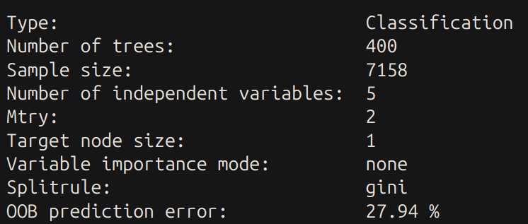
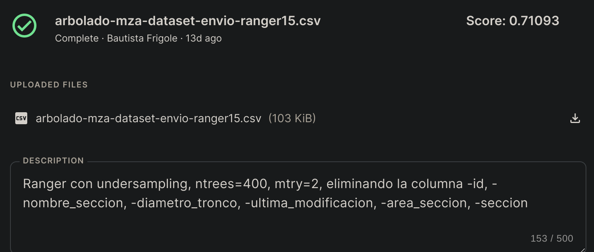

### Desafío Arbolado Kaggle

#### A. Proceso de preprocesamiento:

En la fase inicial del proceso de preprocesamiento, se procedió a la eliminación de diversas variables consideradas no pertinentes para el análisis integral del conjunto de datos. Las variables descartadas son:

- id
- nombre_seccion
- diametro_tronco
- ultima_modificacion
- area_seccion
- seccion

Además, se abordó eficazmente el desafío de desbalanceo mediante la aplicación de la técnica de Undersampling. Para ello, se generó un subconjunto de árboles sin inclinación peligrosa, asegurándose de que la cantidad de elementos en este subconjunto fuera equitativa en comparación con aquellos que presentaban peligrosidad. Posteriormente, se fusionaron ambos conjuntos, configurando así un conjunto de entrenamiento homogéneo y representativo.

#### B. Resultados obtenidos sobre el conjunto de validación

#### C. Resultados obtenidos en Kaggle

#### D. Descripción detallada del algoritmo propuesto

El algoritmo implementado se basa en un modelo de Random Forest utilizando la librería ranger. La configuración del modelo se realizó cuidadosamente, utilizando los siguientes parámetros:

num.trees = 400
mtry = 2
