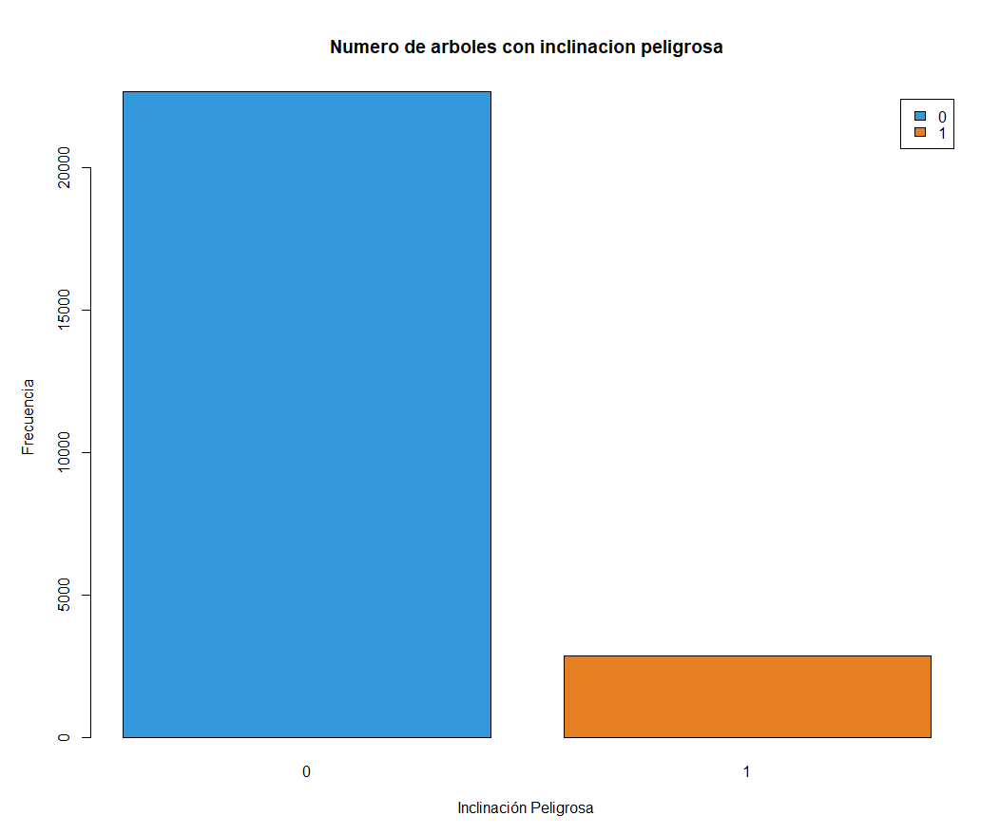
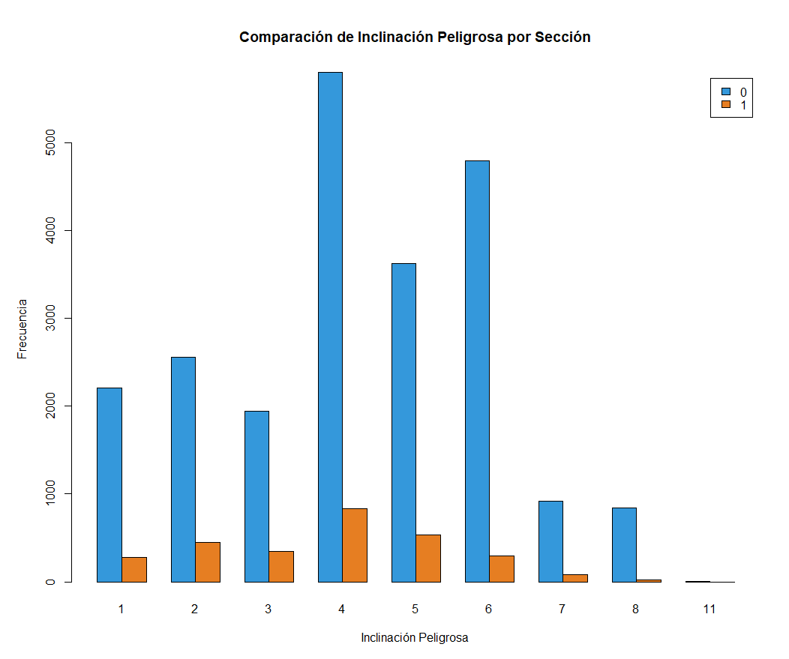
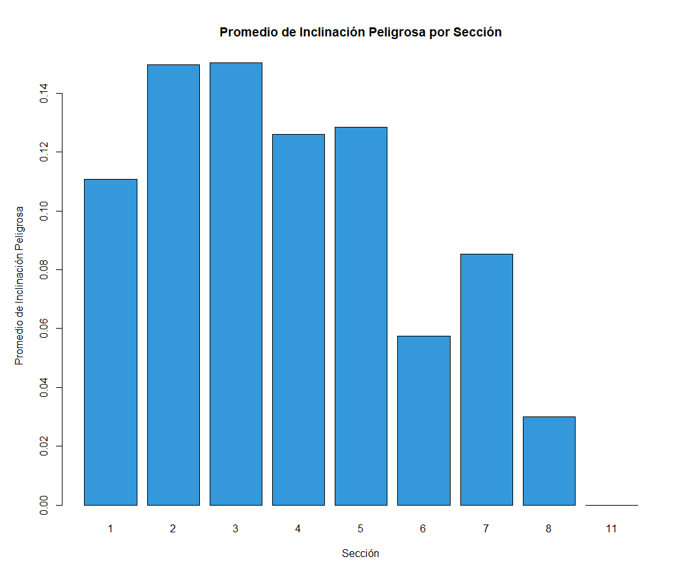
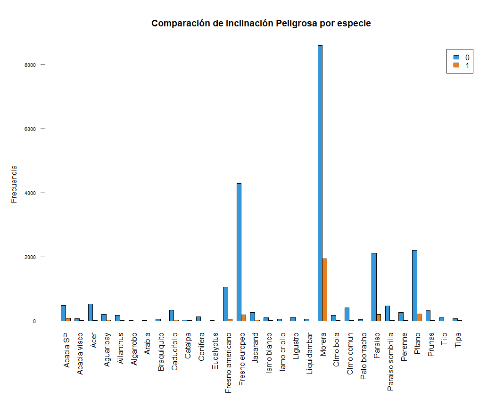
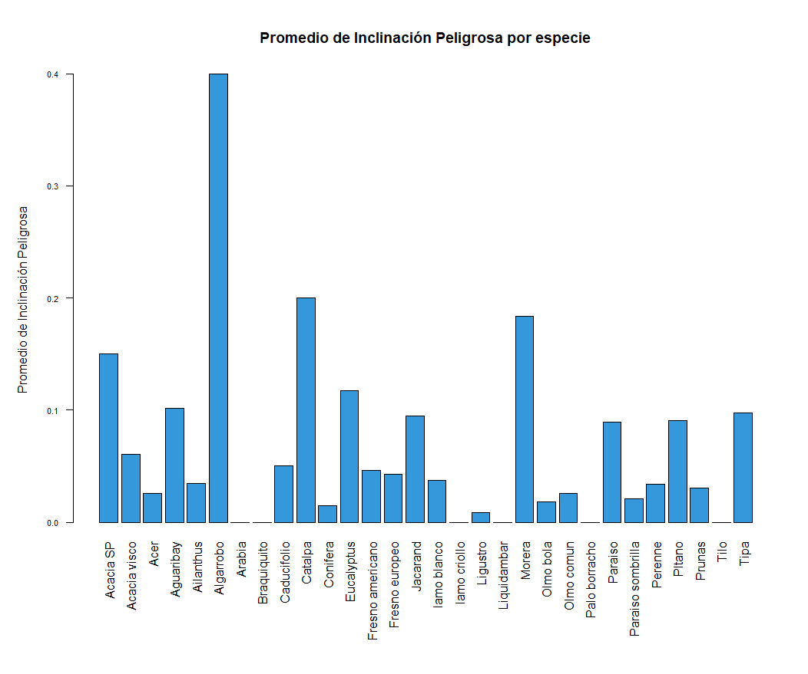
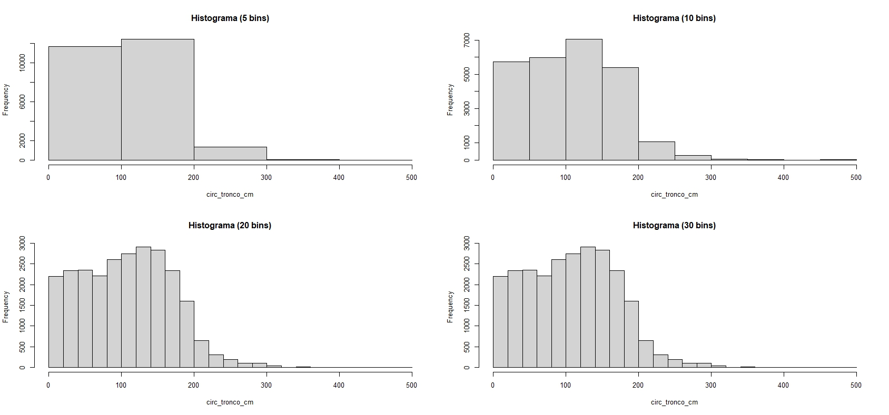
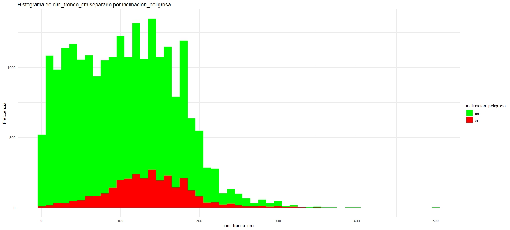

## EDA

### 2. A partir del archivo arbolado-mendoza-dataset-train.csv responder las siguientes preguntas:

#### ¿Cual es la distribución de las clase inclinacion_peligrosa?

A continuación se muestra la distribución de las clases de la variable inclinacion_peligrosa:

Se puede observar que la clase `no` es la que cuenta con mayor cantidad de registros

#### ¿Se puede considerar alguna sección más peligrosa que otra?

Como se puede observar en los gráficos, existen algunas secciones que tienen mayor numero de arboles con inclinacion peligrosa. En promedio, en las secciones 2 y 3, hay mayor posibilidad de encontrar un arbol con inclinacion peligrosa.

#### ¿Se puede considerar alguna especie más peligrosa que otra?

Como se puede observar en los gráficos, existen algunas especies que tienen mayor numero de arboles con inclinacion peligrosa. En promedio, los Algarrabos son los que tienen mayor posibilidad de tener inclinacion peligrosa.

### 3. A partir del archivo arbolado-mendoza-dataset-train.csv,

#### b. Histograma de frecuencia para la variable circ_tronco_cm.

#### c. Histograma de frecuencia para la variable circ_tronco_cm pero separando por la clase de la variable inclinación_peligrosa.

#### d. Criterios de corte para cada categoría de circ_tronco_cm_cat [bajo, medio, alto, muy alto]:

Se tomaron los cortes de la siguiente manera: (0, 60, 180, 250, Inf).
